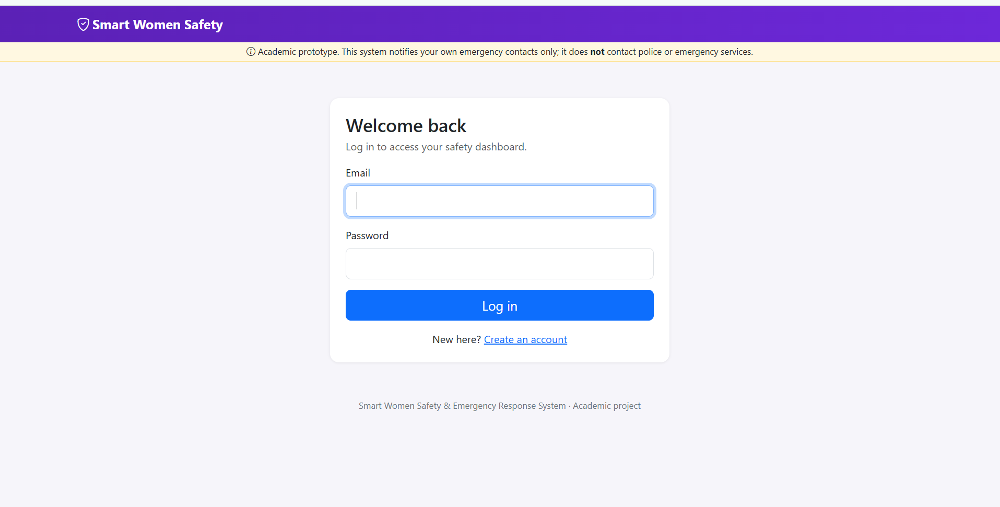
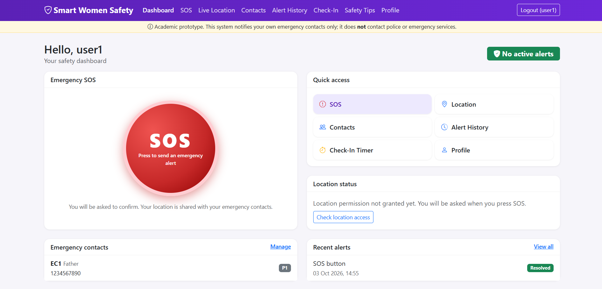
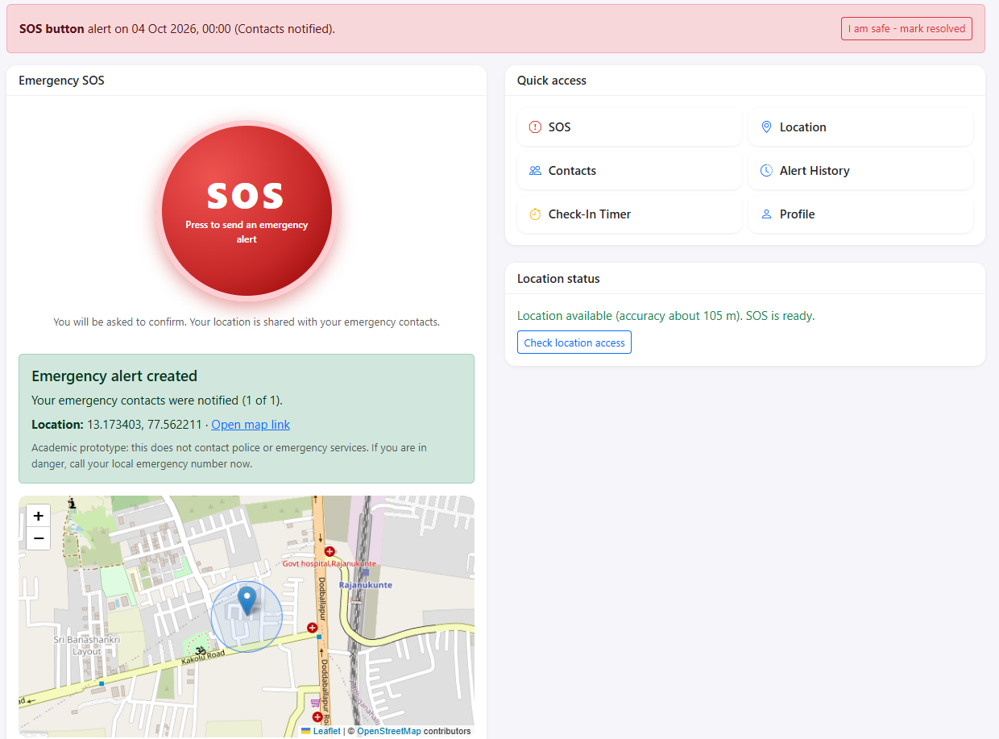
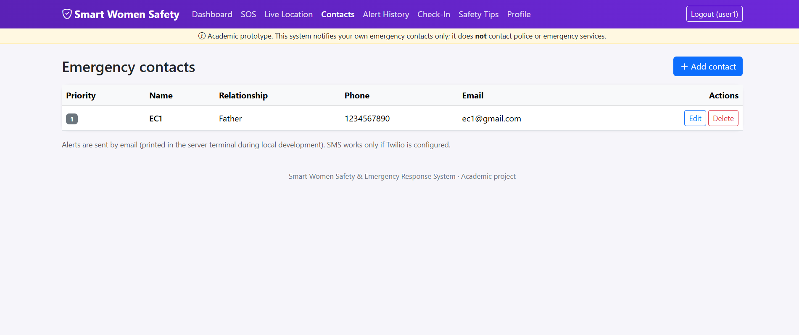
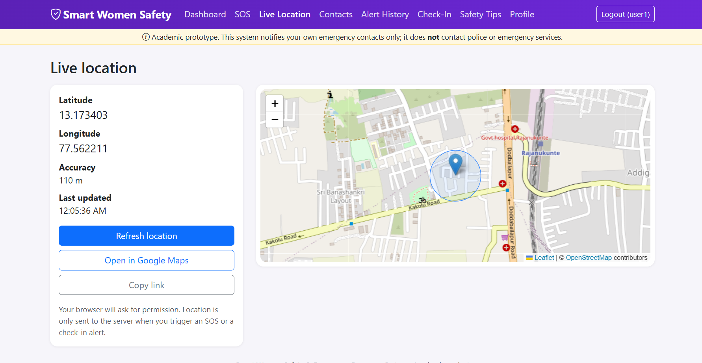
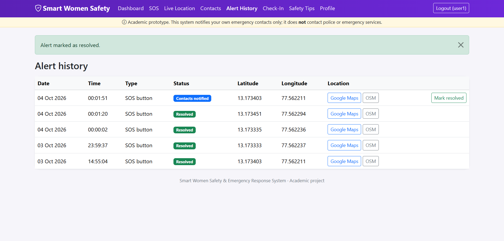
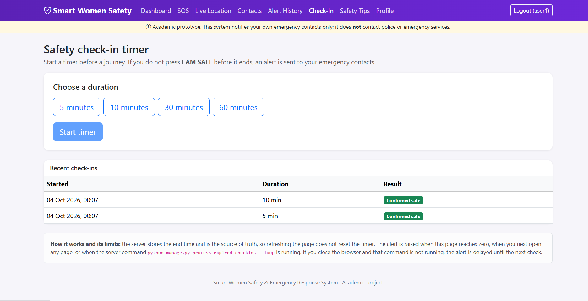
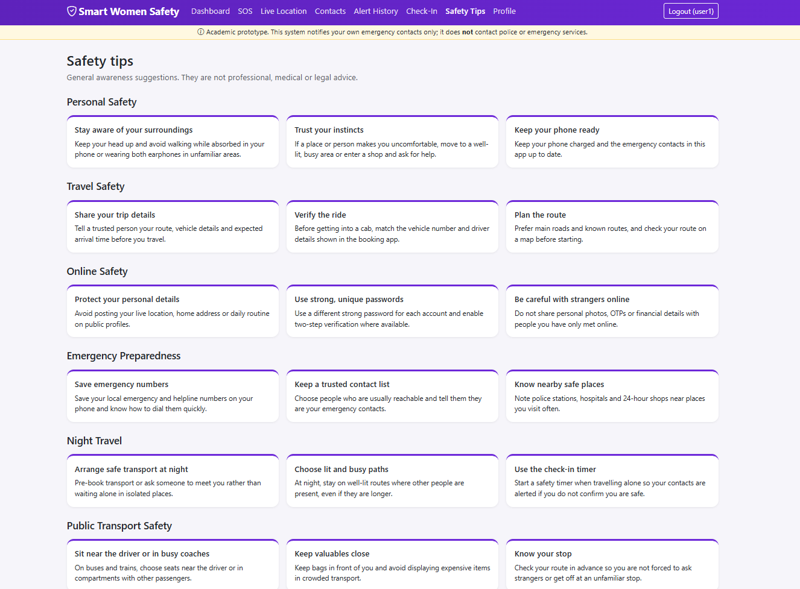
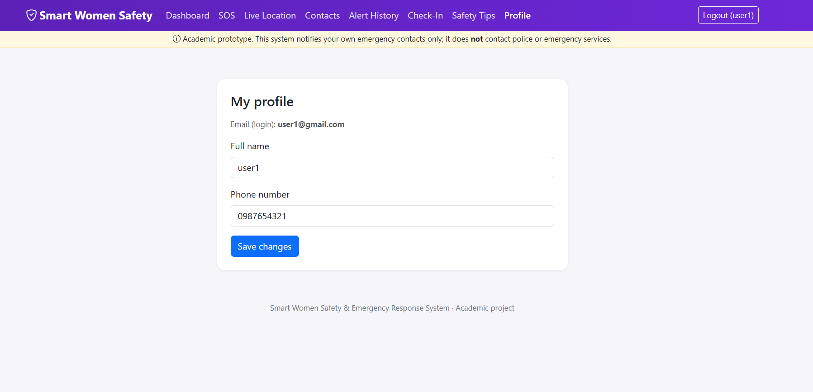

# Smart Women Safety & Emergency Response System

A web-based **academic prototype** that lets a registered user trigger an emergency alert, share her live location on a map, notify trusted emergency contacts, run a safety check-in timer, and read safety tips.

Built with **Django, SQLite, Bootstrap 5, JavaScript, Leaflet.js and OpenStreetMap**. No paid services are needed to run it.

> **Disclaimer:** this is a student project. It notifies the user's *own* emergency contacts (by email, and optionally SMS). It does **not** contact police or any emergency service and cannot guarantee anyone's safety. In real danger, call your local emergency number.

---

## 1. Project Overview

After registering, a user adds trusted contacts. Pressing the large **SOS** button asks for confirmation, reads the browser's location, shows it on an OpenStreetMap map, stores an alert in the database and emails every contact a message containing a map link. A **Safety Check-In** timer does the same automatically if the user does not press "I AM SAFE" in time.

## 2. Problem Statement

In an emergency, a person may not have time to unlock a phone, open a map, copy a location and message several people. A single-action tool that shares an accurate location with trusted people, and that can fire automatically if the user cannot respond, reduces that delay.

## 3. Objectives

- Provide one-tap emergency alerts with location sharing.
- Let users manage multiple prioritised emergency contacts.
- Keep a private history of alerts per user.
- Offer a server-backed safety timer that alerts contacts if the user does not check in.
- Work locally with free tools only (SQLite, console email, OpenStreetMap).
- Follow basic security practice (CSRF, authentication, per-user data isolation, input validation, no hard-coded secrets).

## 4. Features

| Area | What it does |
|---|---|
| Authentication | Register, log in (with email), log out, profile editing, Django password validation and hashing |
| Dashboard | Safety status, large SOS button, location-permission check, contacts, recent alerts, tips, quick links |
| SOS | Confirmation dialog, geolocation, Leaflet map, map link, alert saved, contacts notified, clear result message |
| Emergency contacts | Add, edit, delete, list; relationship, phone, email, priority |
| Live location | Latitude/longitude, accuracy, map, copy/open map link, refresh; friendly errors for denied, unavailable, timeout, unsupported and offline |
| Alert history | Paginated table of the user's own alerts with date, time, type, status, coordinates, map links, "mark resolved" |
| Safety check-in | 5/10/30/60 minute timer, JavaScript countdown, **I AM SAFE**, Cancel; alert and notification on expiry |
| Safety tips | Six categories shown as cards |
| Admin | Manage users, contacts, alerts, check-ins, tips and notification logs with search and filters |
| Notifications | Email (console backend by default, SMTP via `.env`), optional Twilio SMS, per-contact delivery log |

## 5. Technology Stack

- **Backend:** Python, Django 5.2 (LTS)
- **Database:** SQLite
- **Frontend:** HTML5, CSS3, JavaScript, Bootstrap 5, Bootstrap Icons
- **Maps and location:** Browser Geolocation API, Leaflet.js, OpenStreetMap tiles
- **Config:** python-decouple (`.env`)
- **Optional:** Twilio (SMS), SMTP (real email)

Bootstrap, Bootstrap Icons and Leaflet are loaded from the jsDelivr CDN, and map tiles come from OpenStreetMap, so the **browser needs internet access** for styling and maps. The Python server itself needs no internet.

## 6. System Architecture

```
 Browser (HTML + Bootstrap + JS + Leaflet)
   |  Geolocation API -> latitude / longitude
   |  fetch() POST (JSON + CSRF token)
   v
 Django URLs -> Views (login required) -> Forms (validation)
                    |                         |
                    v                         v
              services.py                  Models (ORM)
        (alert + notification logic)          |
                    |                         v
        +-----------+-----------+          SQLite
        v                       v
 Email (console -> SMTP)   SMS (Twilio, optional)
```

Design points worth knowing for a viva:

- **Thin views, logic in `services.py`.** The SOS button and the expired timer both call `trigger_alert()`.
- **Alert is saved before notifying.** A mail or SMS failure never loses the alert; each attempt is recorded in `NotificationLog`.
- **The server owns the timer.** `expires_at` is stored in the database; JavaScript only displays the countdown, so a page refresh does not reset it.
- **Idempotent expiry.** `expire_checkin()` uses a conditional `UPDATE ... WHERE status='ACTIVE'`, so an alert can never be created twice even if the browser, a page load and the management command race.
- **Email is the login name.** The email is stored in Django's `username` field, which avoids a custom user model.

## 7. Database Design

```
User (django.contrib.auth) --1:1-- Profile
  |
  +--1:N-- EmergencyContact
  +--1:N-- EmergencyAlert --1:N-- NotificationLog --N:1-- EmergencyContact
  +--1:N-- SafetyCheckIn --0..1:1-- EmergencyAlert

SafetyTip (standalone, managed in admin)
```

| Model | Main fields |
|---|---|
| `Profile` | user (1:1), phone_number, created_at |
| `EmergencyContact` | user, name, relationship, phone, email, priority, created_at |
| `EmergencyAlert` | user, latitude, longitude (nullable), alert_type (`SOS` / `CHECKIN_EXPIRED`), status, message, created_at, resolved_at; property `map_link` |
| `SafetyCheckIn` | user, duration, started_at, expires_at, completed, status (`ACTIVE` / `SAFE` / `CANCELLED` / `EXPIRED`), confirmed_at, last_latitude, last_longitude, alert, created_at |
| `SafetyTip` | title, category, description, created_at |
| `NotificationLog` | alert, contact, channel (`EMAIL` / `SMS`), status (`SENT` / `FAILED`), error_message, created_at |

Alert statuses: `TRIGGERED`, `NOTIFIED`, `NOTIFICATION_FAILED`, `NO_CONTACTS`, `RESOLVED`.
Latitude and longitude are nullable because an expired timer can fire when the browser never shared a location; the alert then states that the location is unavailable.

## 8. Project Structure

```
smart_women_safety/
├── manage.py
├── requirements.txt
├── README.md
├── .gitignore
├── .env.example
├── db.sqlite3                  (local database; git-ignored)
├── smart_women_safety/         (project settings and root URLs)
├── safety/
│   ├── models.py  forms.py  views.py  urls.py  admin.py  apps.py
│   ├── services.py             (alerts, notifications, check-in expiry)
│   ├── tests.py
│   ├── management/commands/
│   │   ├── seed_data.py
│   │   └── process_expired_checkins.py
│   └── migrations/
├── templates/
│   ├── base.html
│   ├── registration/           (login.html, register.html)
│   └── safety/                 (dashboard, sos, contacts, location, history, check-in, tips, profile)
├── static/
│   ├── css/style.css
│   └── js/                     (common.js, sos.js, location.js, checkin.js)
└── fixtures/
```

## 9. Installation (Windows)

Requires Python 3.11 or newer (3.12 recommended) and internet access for installing packages.

```
git clone https://github.com/vunnampragnika/smart-women-safety.git
cd smart-women-safety
python -m venv venv
venv\Scripts\activate
python -m pip install --upgrade pip
pip install -r requirements.txt
python manage.py migrate
python manage.py seed_data
python manage.py runserver
```

If PowerShell blocks activation ("running scripts is disabled"), run once:

```
Set-ExecutionPolicy -Scope CurrentUser -ExecutionPolicy RemoteSigned
```

or use Command Prompt (`cmd`) instead.

**Linux / macOS:**

```
python3 -m venv venv
source venv/bin/activate
pip install -r requirements.txt
python manage.py migrate
python manage.py seed_data
python manage.py runserver
```

Then open **http://127.0.0.1:8000/**.

## 10. Configuration

The app runs without any configuration. To customise, copy `.env.example` to `.env`:

```
copy .env.example .env
```

| Variable | Purpose |
|---|---|
| `SECRET_KEY` | Django secret key. A development-only default is used if empty; **set your own for anything beyond local demos** |
| `DEBUG` | `True` for development |
| `ALLOWED_HOSTS` | Comma-separated hosts |
| `EMAIL_HOST`, `EMAIL_PORT`, `EMAIL_HOST_USER`, `EMAIL_HOST_PASSWORD`, `EMAIL_USE_TLS` | Real SMTP. **Leave `EMAIL_HOST` empty** to print emails in the terminal |
| `TWILIO_ACCOUNT_SID`, `TWILIO_AUTH_TOKEN`, `TWILIO_PHONE_NUMBER` | Optional SMS. Also run `pip install twilio` |

Generate a secret key:

```
python -c "from django.core.management.utils import get_random_secret_key; print(get_random_secret_key())"
```

`.env` is git-ignored. Never commit real credentials.

## 11. How to Run

```
venv\Scripts\activate
python manage.py runserver
```

### Creating an admin user

```
python manage.py createsuperuser
```

Then open http://127.0.0.1:8000/admin/.

### Loading sample data

```
python manage.py seed_data
```

Creates 18 safety tips and a demo account (fake data only):

- Email: `demo@example.com`
- Password: `Demo@12345`

Run `python manage.py seed_data --no-demo-user` to create only the tips. The command is safe to run repeatedly.

## 12. How to Use

1. Register (or log in as the demo user). Add emergency contacts.
2. Press **SOS**, confirm, and allow location access. The map, coordinates and map link appear, and the alert email is printed in the terminal running `runserver`.
3. Open **Alert History** to see the alert.
4. Open **Check-In**, choose a duration and press **Start timer**. Press **I AM SAFE** to stop it, or let it reach zero to trigger an alert.
5. Open **Live Location** to view or refresh your position.

**Browser note:** geolocation only works on `http://localhost` / `http://127.0.0.1` or on HTTPS. Opening the site from a phone via `http://192.168.x.x:8000` will be refused by the browser; use an HTTPS tunnel for phone demos.

## 13. How the SOS Feature Works

1. The SOS button opens a confirmation dialog.
2. On confirm, JavaScript calls `navigator.geolocation.getCurrentPosition()`.
3. The Leaflet map shows the position.
4. JavaScript POSTs `{latitude, longitude}` as JSON to `/sos/trigger/` with the CSRF token.
5. The server validates the coordinates (numbers, within -90..90 and -180..180).
6. `trigger_alert()` saves an `EmergencyAlert`, builds the message
   `EMERGENCY ALERT: <name> may need assistance. Current location: <map link>`,
   and `notify_contacts()` emails each contact (plus SMS if Twilio is configured).
7. Each attempt is stored in `NotificationLog`, the alert status becomes `NOTIFIED`, `NOTIFICATION_FAILED` or `NO_CONTACTS`, and the result is shown to the user.

If location cannot be obtained, no alert is created and the user sees a specific reason with a retry button.

## 14. How Location Tracking Works

Location is read on demand with the browser Geolocation API and is **not** tracked continuously. It is sent to the server only for an SOS, or for a check-in (when the timer starts and, if available, when it expires). The Live Location page keeps the position in the browser only. Error cases handled: permission denied, position unavailable, timeout, unsupported browser, and offline.

### Safety check-in reliability

- The server stores `expires_at`; the browser countdown is re-synced with the server's remaining seconds and a 15-second status poll.
- An expired timer raises its alert when **any** of these happens first: the open page reaches zero; the user loads the dashboard or check-in page; the status poll runs; or the management command runs.
- For alerts while no browser is open, run in a second terminal:

```
python manage.py process_expired_checkins --loop
```

  (or schedule `python manage.py process_expired_checkins` with Windows Task Scheduler).

## 15. Testing

```
python manage.py test
```

46 tests cover registration, login, logout, contact create/edit/delete and ownership isolation, SOS creation and coordinate validation, CSRF enforcement, email notification and failure handling, alert history, authentication restrictions, the full check-in lifecycle (start, safe, cancel, expiry, idempotency, missing location), the management commands and the admin pages.

## 16. Screenshots

## 16. Screenshots











## 17. Limitations

- **Not an emergency service.** No police, ambulance or helpline integration exists.
- Email is printed to the console unless SMTP is configured; contacts receive nothing otherwise. SMS needs a paid Twilio account.
- Location comes from the browser and can be inaccurate indoors or on desktops using Wi-Fi positioning.
- Geolocation requires `localhost` or HTTPS.
- Check-in alerts are delayed when no browser is open and the management command is not running (a production system would use Celery or a cron service).
- A laptop or phone must be online, awake and have the page available for the SOS to be sent.
- Bootstrap/Leaflet load from a CDN and map tiles from OpenStreetMap, so the browser needs internet.
- No rate limiting, two-factor authentication or email verification; SQLite and `runserver` are for development only.
- The JavaScript was syntax-checked and the HTTP endpoints were tested, but browser geolocation, Leaflet rendering and the live countdown must be verified in a real browser.

## 18. Future Enhancements

- Android/iOS app or PWA with background location and a hardware-button trigger
- Continuous live-location sharing page for contacts
- Celery + Redis for reliable timers; WebSockets for live updates
- Audio/video evidence capture; offline SMS fallback
- Email verification, 2FA, rate limiting; PostgreSQL and HTTPS deployment
- Integration with official emergency-number APIs where available

## 19. Disclaimer

This software is an educational prototype provided "as is". It does not guarantee delivery of any alert, does not contact emergency services, and must not be relied on for personal safety. Safety tips are general suggestions, not professional, medical or legal advice.

## 20. Contributors

- VUNNAM PRAGNIKA